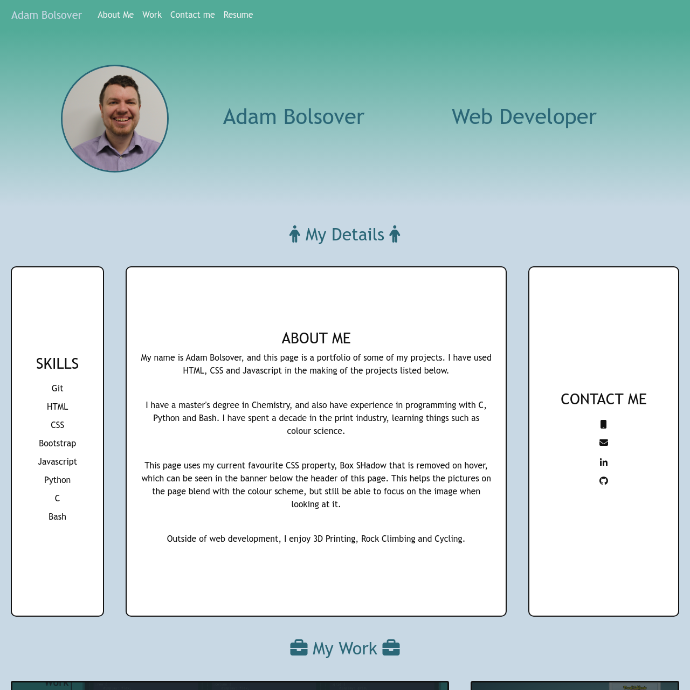

# Bootcamp Challenge 3 - Bootstrap Portfolio

## Description 

This project was created using HTML, CSS and Bootstrap to make a Portfolio Page. The project had the following requirements:

* A Navigation bar
    * A navigation menu at the top.
    * Include links that are applicable to my portfolio.
    * Links should navigate to the appropriate sections 
* A hero section
    * A jumbotron featuring my picture, my name, and any other information I'd like to include.
* A work section
    * A section displaying your work in grid. 
    * Use bootstrap cards for each project.
    * The description should give a brief overview of the work.
    * A skills section
* An about / contact section.
    * An "About Me" section in the same row.
* A footer section.
    * All hyperlinks should have a hover effect.
    * All buttons should display a box shadow upon hover.

The page in this repo is the result.

## Installation

The site does not require installation steps.

## Usage 

The website can be viewed at [https://bowseruk.github.io/bootstrap-portfolio/](https://bowseruk.github.io/bootstrap-portfolio/) with Google Chrome. The source can be viewed in Chrome by right clicking and selecting inspect.

## Credits

This site was based on a project by edX Boot Camps LLC.

[W3School](https://www.w3schools.com/) was used as a reference for elements to use and good practice.

The changes were checked with [W3C Validator](https://validator.w3.org/).

## License

This project uses the licence in the LICENCE file of the repo.
